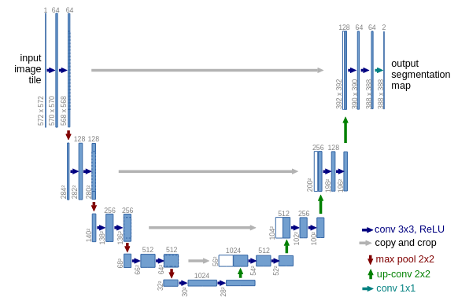

# UNet Implementation and Explanation

## Overview
This repository contains a Python notebook showcasing the implementation of the UNet architecture for image segmentation tasks. UNet is a convolutional neural network architecture widely used for semantic segmentation of images, particularly in the medical imaging domain.

## UNet Architecture
UNet is characterized by a U-shaped architecture, which consists of a contracting path followed by an expanding path. The contracting path captures context through convolutional layers, while the expanding path enables precise localization through transposed convolutions.

## Notebook Contents
- `u_net.ipynb`: This Jupyter Notebook provides a step-by-step guide to understanding and implementing UNet using PyTorch. It includes detailed explanations of each component of the architecture, such as convolutional layers, skip connections, and loss functions.
